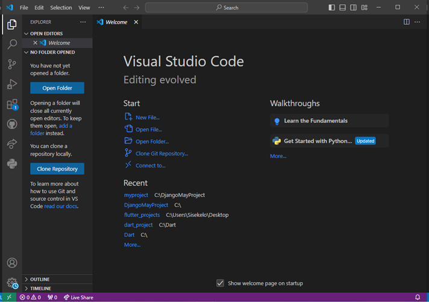
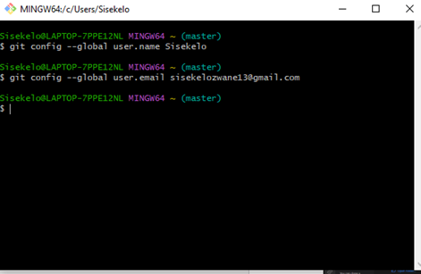
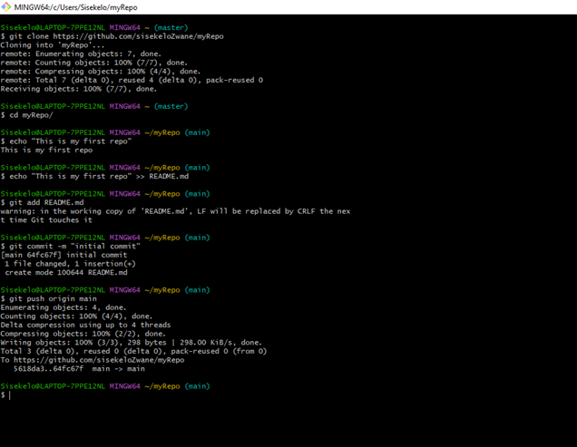
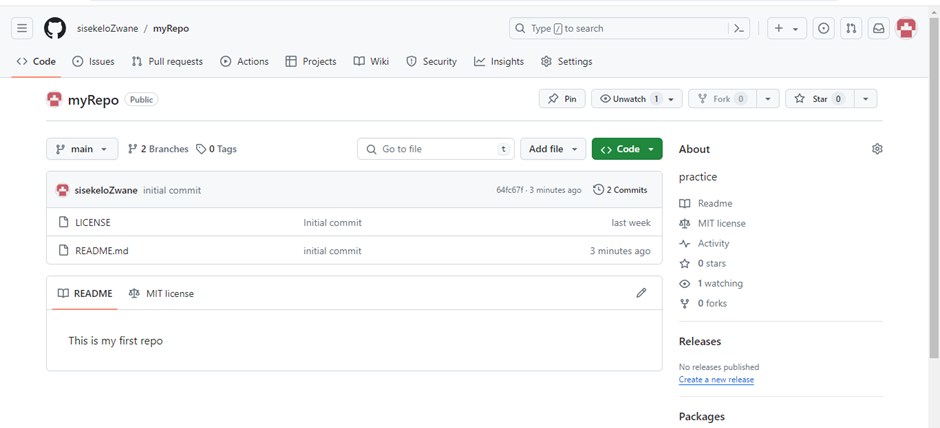
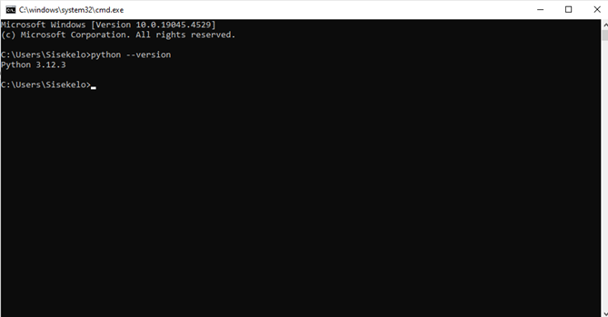
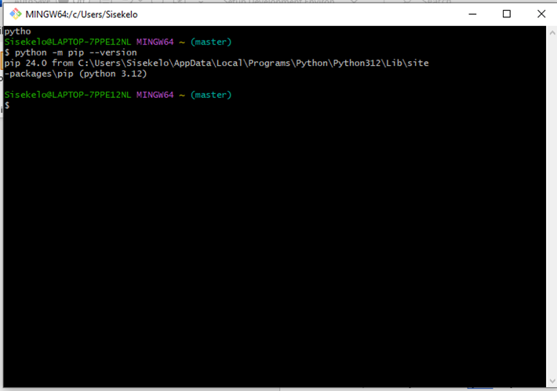
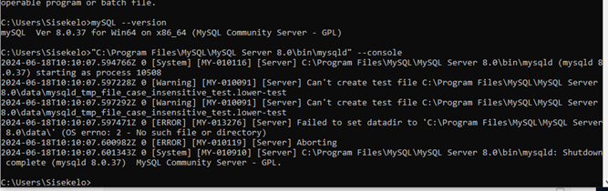

The Set up process--
Selecting the Operating system--
There was not much I did because I was already using the latsest version which is Windows 11, so I just installed routine updates

Install a Text Editor or Integrated Development Environment (IDE)--
•	Download Visual Studio Code for windows from https://code.visualstudio.com/Download
•	Run the installer and made sure to specify installation location and then launch Visual Studio Code to begin coding
 

Set Up Version Control System
•	Download git from https://www.git-scm.com/ and install it 
•	Run Gitbash as Administrator and configure Git with name and email
 
•	Go to  https://github.com and create a github account
•	Create a repository then clone it from gitbash then make a commit
 

This is how it looks on github

 

Install Necessary Programming Languages and Runtimes
•	Download the latest version of python from the official website https://www.python.org/ 
•	Run the installer, select install now and check the box to add path
•	When the install is done , check on the command prompt using python –version
  

Install Package Managers
•	Pip was already installed with python so I just verified with python -m pip --version

 

Configure a Database (MySQL)
•	Download mySQL for windows on https://dev.mysql.com/downloads/installer/ , click on no thanks just start my download
•	Setup the configuration in mySQL installer pick Server only then start the installation
•	Configuration is as follows
a)	Type and Networking – Picked Development Computer, and check the box with Show advanced logging options. Everthung else is left as it is , then click next
b)	Authentication Method – Click the recommended Use Strong Password Authentication option then next
c)	Accounts and Roles – Add a strong password for the root account which must be remembered
d)	Windows Service -  Maintained the already made configurations
e)	Logging Options - Maintained the already made configurations
f)	Apply Configuration – Click execute to apply the configurations
•	Start mySQL for the first time in the command prompt using path and –console
 

Set Up Development Environments and Virtualization
1.	Installing flutter and dart
•	Download flutter from the official website https://flutter.dev/ 
•	After the download move it to the C:/ drive and extract all the files then delete the compressed file
•	Add flutter path to system environment variables
•	Check via Gitbash if it installed properly using flutter –version, after successful install run flutter doctor to scan for issues, I received 3 healthy issues
•	Download the Dart SDK on https://dart.dev/get-dart/archive ; pick the latest version under the stable channel
•	Extract all the files then delete compressed file
•	Run dart in command prompt by opening the bin folder in dart then typing cmd
•	Add dart path to system environment variables
•	Now you can run anywhere on the system to check use dart –version either on Gitbash, command prompt or Powershell 

2.	Installing Django 
•	Run this command in Gitbash to install Django python -m install Django
•	Check installation Django-admin --version

3.	Installing virtual environment
•	Install virtual environment on Gitbash using python -m pip install virtualenv 
•	Create the virtual environment python -m viirtualenv nameOfVirtualEnvironment 
•	Activate using source nameOfVirtualEnvironment/Scripts/activate

Explore Extensions and Plugins
•	I installed the following extensions on Visual studio Code : Dart , Flutter, Python , Python Debugger

Challenges
1.	MySQL configuration: I tried to reconfigure and the root password was not going through
2.	Most of the application were not showing even though they had been installed
Solutions
1.	For the MySQL configuration I unistalled and deleted all program files withthe aid of a youtube video and everything worked out in the end
2.	Most applications were not working because of the path, so I made sure after that after installing I updated my system environment variables with the right path
